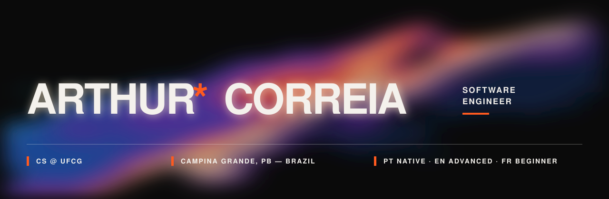

<p align="center">
  
</p>

<p align="center">
  <a href="mailto:arthurcorreialeite@gmail.com"></a>
  <a href="https://www.linkedin.com/in/arthur-correia-b7b883222/"></a>
</p>


Computer Science undergrad at **UFCG**. Software engineering intern at
**Valcann (an EPI-USE company)**, building full-stack applications.


```
LANGUAGES ······ TypeScript · JavaScript · Java · Python · SQL
BACK-END ······· Node.js · Express · Prisma ORM
FRONT-END ······ React · HTML · CSS
DATA ··········· PostgreSQL · MySQL · MongoDB
CLOUD ·········· AWS
TESTING ········ Jest · Vitest · JUnit 5 · Pytest
TOOLS ·········· Git · GitHub · Jira · Linux
```


```
PORTUGUESE ····· Native
ENGLISH ········ Advanced
FRENCH ········· Beginner
```

